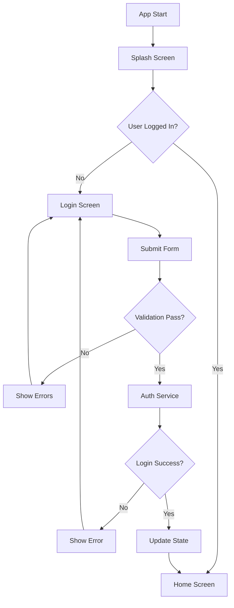

# Project Architecture Documentation

This document outlines the scalable and maintainable architecture implemented for the Tick Tick Flutter application.

## 🏗️ Architecture Overview

The application follows **Clean Architecture** principles with clear separation of concerns:

```
lib/
├── main.dart                     # App entry point
├── constants/                    # App-wide constants
│   ├── app_constants.dart       # Colors, strings, sizes
│   └── app_routes.dart          # Route definitions
├── models/                      # Data models
│   └── user.dart               # User entity
├── providers/                   # Riverpod state management
│   └── auth_provider.dart      # Authentication state
├── routes/                     # Navigation configuration
│   ├── app_router.dart         # Main router provider
│   └── route_config.dart       # Route definitions
├── screens/                    # UI screens
│   ├── splash_screen.dart      # Initial loading screen
│   ├── enhanced_login_screen.dart # Main login screen
│   └── home_screen.dart        # Post-login screen
├── services/                   # Business logic
│   ├── auth_service.dart       # Authentication logic
│   ├── auth_guard_service.dart # Route protection
│   └── form_validation_service.dart # Validation logic
└── widgets/                    # Reusable UI components
    ├── custom_button.dart      # Styled button
    ├── custom_text_field.dart  # Styled input field
    └── login_form.dart         # Complete login form
```

## 🔧 Key Architectural Features

### 1. Scalable Routing System

**Route Constants (`app_routes.dart`)**

- Centralized route definitions
- Type-safe navigation
- Route grouping (auth routes, protected routes)
- Helper methods for route validation

**Route Configuration (`route_config.dart`)**

- Separates route definitions from router logic
- Supports navigation observers
- Error handling for invalid routes
- Easy to extend with new routes

**Auth Guard Service (`auth_guard_service.dart`)**

- Handles route-level authentication
- Configurable redirect logic
- Testable authentication flow
- Supports different user states

### 2. Enhanced State Management

**Auth Provider (`auth_provider.dart`)**

- Uses Riverpod's `Notifier` pattern
- Immutable state management
- Clear loading and error states
- Reactive UI updates

**State Structure**

```dart
class AuthState {
  final bool isLoggedIn;
  final User? user;
  final bool isLoading;
  final String? error;
}
```

### 3. Form Validation System

**Centralized Validation (`form_validation_service.dart`)**

- Reusable validation rules
- Composable validators
- Consistent error messages
- Easy to test and maintain

**Supported Validations**

- Email format validation
- Password strength requirements
- Required field validation
- Phone number validation
- Name validation with character restrictions

### 4. Component-Based UI

**Custom Widgets**

- `CustomTextField`: Styled input with validation
- `CustomButton`: Loading states and consistent styling
- `LoginForm`: Complete form logic encapsulation

**Benefits**

- Consistent design system
- Reusable across screens
- Easy to modify globally
- Better testing capabilities

## 🚀 Scalability Features

### 1. Easy Route Addition

To add a new route:

1. Add route path to `AppRoutes`
2. Add route configuration to `RouteConfig`
3. Create the screen widget
4. Update auth guard logic if needed

### 2. Form Extension

To add new forms:

1. Create validation rules in `FormValidationService`
2. Create form widget (like `LoginForm`)
3. Use in screen with error handling

### 3. State Management

To add new providers:

1. Create state class with `copyWith` method
2. Create notifier extending `Notifier<YourState>`
3. Create provider with `NotifierProvider`

## 🔐 Authentication Flow



## 🧪 Testing Strategy

### Unit Tests

- Service layer testing (AuthService, ValidationService)
- Provider testing (AuthProvider)
- Model testing (User model)

### Widget Tests

- Form validation testing
- Custom widget testing
- Screen navigation testing

### Integration Tests

- Complete authentication flow
- Route navigation testing
- Error handling scenarios

## 📦 Dependencies

### Core Dependencies

```yaml
flutter_riverpod: ^3.0.3 # State management
go_router: ^16.2.5 # Navigation
```

### Development Dependencies

```yaml
flutter_test: ^SDK_VERSION
mockito: ^5.4.2 # Mocking for tests
```

## 🔧 Development Guidelines

### Code Organization

1. **Single Responsibility**: Each class has one responsibility
2. **Dependency Injection**: Use providers for dependencies
3. **Immutable State**: Use copyWith pattern for state updates
4. **Error Handling**: Consistent error handling patterns

### Naming Conventions

- **Files**: snake_case (e.g., `auth_provider.dart`)
- **Classes**: PascalCase (e.g., `AuthProvider`)
- **Variables**: camelCase (e.g., `isLoggedIn`)
- **Constants**: UPPER_SNAKE_CASE (e.g., `API_BASE_URL`)

### Best Practices

1. **Use const constructors** where possible
2. **Dispose controllers** in stateful widgets
3. **Handle loading states** in UI
4. **Validate user input** consistently
5. **Use meaningful error messages**

## 🚀 Future Enhancements

### Short Term

- [ ] Registration screen
- [ ] Forgot password functionality
- [ ] Remember me persistence
- [ ] Social login integration

### Medium Term

- [ ] Profile management
- [ ] Settings screen
- [ ] Push notifications
- [ ] Offline support

### Long Term

- [ ] Multi-language support
- [ ] Dark theme
- [ ] Advanced security features
- [ ] Analytics integration

## 📝 Configuration

### Environment Setup

1. Clone repository
2. Run `flutter pub get`
3. Configure development environment
4. Run `flutter run`

### Build Configuration

- Debug: `flutter run`
- Release: `flutter build apk --release`
- Web: `flutter build web`

This architecture provides a solid foundation for a scalable Flutter application that can grow with your requirements while maintaining code quality and developer productivity.
